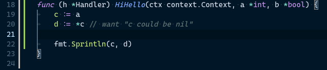
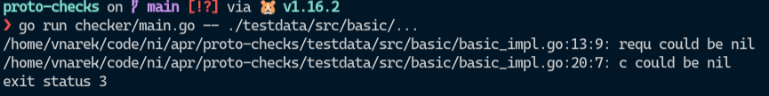

# Protocol buffer checky pro jazyk GO
## Zadání

## Motivace

Jazyk GO má velmi mocnou knihovnu pro vytváření GRPC serverů. Tato knihovna ale není vždy uživatelsky přívětivá a vedla mě
k množství hloupých bugů, které by šly odchytit statickou analýzou. Jedním z nejčastějších bylo chybějící volání getteru při přístupu k
datům v requestu. Pokud byl určitý field v requestu `nil` tak getter zajistil, že ani v takovém případě aplikace nespadla a místo toho vrátila
`zero` hodnotu pro daný typ fieldu.

Proto aby bylo možné tyto chyby odchytit, potřebujeme `nilness` analýzu. U všech proměnných, u kterých je nenulová pravděpodobnost, že můžou být `nil`, bychom měli upozornit uživatele, aby použil getter ošetřující dereferenci `nil`.
## Implementace

Na nilness analýzu potřebujeme nejprve získat normalizovaný control flow graph. Tento cfg, využijeme jak pro získání `points-to` struktury z 
pointer analýzy, tak na samotnou nilness analýzu.

### Control flow graph
Jako první jsme museli navrhnout, jak bude vypadat control flow graph (CFG). Obě dvě analýzy vyžadují na vstupu program, ve kterém jsou normalizované všechny operaci s ukazeteli do následujích tvarů:
```c++
X = alloc P
X1 = &X2
X1 = X2
X1 = *X2
*X1 = X2
X = null (nil v případě jazyka Go)
*X (dereference, která není součástí žádného z předchozích tvarů)
```
Náš CFG se tedy narozdíl od běžných CFG skládá pouze z těchto sedmi uzlů (ostatní operace nejsou pro naše potřeby důležité, proto je z grafu vynecháme).
Dále pro účely nilness analýzy jsme od grafu vyžadovali, aby každý uzel obsahoval jak hrany na svoje následovníky,
tak i na své předky. Jelikož tyto požadavky byly velmi konkrétní, bylo nám téměr jasné, že CFG si budeme muset napsat z velké části sami.

K sestavení CFG jsme využili [go knihovnu cfg](https://pkg.go.dev/golang.org/x/tools/go/cfg), která pro každou funkci
sestaví graf basic bloků (ty už neobsahují AST nody, které mění plynutí programu - tzn. If, Switch, atd.). Tento graf nepracuje s argumenty funkce,
tudíž jsme je museli do výsledného CFG přidat dodatečně. Přidáváme pouze ukazatelové typy, protože ostatní typy nás v rámci pointer a nilness analýzy nezajímají.

Dále je tento graf jednosměrný, pro každý uzel jsou definovaný jen následovníci. Předky jsme tedy museli doplnit.
Dále jsme z bloku odstranili veškeré AST nody, které neobsahují operace s ukazateli. To znamená, že některé basic bloky
z grafu vypadly úplně. V tom případě bylo potřeba správně napojit hrany grafu, aby se neporušila struktura programu. Např. tento Go program:
```go
sum := new(int)
for i := 0; i < 2; i++ {
    sum = x
}
res := *sum
```
Knihovna cfg rozloží do těchto pěti basic bloků:
```
0:  (next: 3)
    sum := new(int)
    i := 0
    
1:  (next: 4)
    sum = **x
    
2:  (next: )
    res := *sum
    
3:  (next 1, 2)
    i < 2
    
4:  (next: 3)
    i++
```
Nyní spustíme náš algoritmus, který začne normalizovat od prvního basic bloku jednotlivé výrazy a zároveň se začne zbavovat výrazů, které pro nás
nejsou důležité. Z příkladu si můžeme všimnout, že bloky 3 a 4 neobsahují žádné operace s ukazeteli. Těchto bloků
se zbavíme úplně a správně napojíme hrany. Zároveň doplníme kromě následovníků i hrany na předchůdce:
```
0:  (next: 1, 2) (prev: )
    sum := new(int)
    
1:  (next: 1, 2) (prev: 0, 1)
    sum = **x
    
2:  (next: ) (prev: 0, 1)
    res := *sum
```
K normalizaci výrazu dojde v případě uzlu 1 (protože nemá jeden z 7 tvarů, který obě analýzy vyžadují), ze kterého se
stanou dva uzly, který již požadovaný tvar budou mít:
```
0:  (next: 1_1, 2) (prev: )
    sum := new(int)
    
1_1:(next: 1_2) (prev: 0, 1_2)
    _t1 = *x
    
1_2:(next: 1_1, 2) (prev: 1_1)
    sum = *_t1
    
2:  (next: ) (prev: 0, 1_2)
    res := *sum
```
Výsledkem našeho algoritmu je tedy následující CFG:
```
     ↓
[sum = alloc]→→
     ↓        ↓
[_t1 = *x]    ↓
    ↓ ↑       ↓
[sum = *_t1]  ↓
     ↓        ↓
[res = *sum]←←↓
     ↓
```
Tento graf používá nilness analýza. Pointer analýza používá modifikovanou verzi tohoto grafu, která se skládá
z po sobě jdoucích uzlech (nejedná se tedy úplně o graf, jako spíš sekvenci uzlů). Je to kvůli tomu, že k analýze se
používá Andesenův algoritmus, který je flow-insensitive a nezáleží mu na pořadí jednotlivých uzlů.

Algoritmus se nachází v packagi `cfg`. V souboru `cfg/testdata` se nachází sada testů, kde jsou referenční výstupy
jednotlivých casů uloženy v souborech s příponou *.golden*. Tyto testy většinou kontrolují správnou normalizaci
operací s ukazateli, zároveň se také snaží pokrýt všechny způsoby, jak jdou jednotlivé operace definovat. Pro zajímavost,
například uzel `[x = null]` jde v jazyku Go zapsat těmito ekvivalentními způsoby:
```go
x = nil
x := nil
var x *int = nil
var x *int
x = (((nil)))
```
Celá sada testů se spouští příkazem:
```sh
go test -v ./cfg/...
```

### Pointer analýza

Výsledný CFG předáme pointer analýze, která je v packagi `pointto`. Tato analýza implementuje
Andersenův algoritmus z knihy a výsledkem analýzy je datová struktura `map[string][]string`, která mapuje
jméno proměnné na buňky reprezentující místa v paměti, na které tato proměnná může ukazovat.

Pravidla definovaná Anderesenovým algoritmem splňují tvary, které očekává kubický algoritmus z knihy, proto ho
používáme k reprezentaci těchto pravidel.

Kubický algoritmus pracuje nad datovou strukturou acyklického grafu, kde uzly reprezentující jednotlivé proměnné 
obsahují informaci o tom, na jaké buňky můžou tyto proměnné ukazovat. Hrany mezi těmito uzly reprezentují relaci podmnožiny.
Pokud má uzel `X2` hranu do uzlu `X1`, pak tím definuje relaci "`X2` je podmnožinou `X1`".

Při přidávání nových pravidel, se updatne graf a tato změna se zpropaguje do všech uzlů propojených hranou. Pokud dojde k
zacyklení, všechny uzly v cyklu se spojí do nového, který sjednocení všech buněk.

Pravidla kubického algoritmu:

- *t∈x*

  Tato relace nastaví uzlu flag `in` pro token `t` a pokud jsou v grafu nějaká pravidla druhého typu, které
  čekaly na splnění této podmínky, tak jejich pravidla taktéž provedeme.
- *t∈x⇒y⊆z*

  Pokud je implikace splněná, tak přidáme hranu z `y` do `z`. Pokud není splněná, tak si uložíme toto pravidlo na pozdější vyhodnocení, 
  ke kterému může dojít pokud později, dostaneme-li pravidlo prvního typu ve tvaru `t∈x`.

Pro každý node z CFG přidáme příslušná pravidla definovaná u Andersona. Přidání pravidel probíhá pomocí dvou metod na `DAG`: `AddImpliedConstrain` a `AddInContrain`.

Testy pro pointer analýzu se spouští příkazem:

```sh
go test -v ./pointto/...
```

### Nilness analýza
Pro nilness analýzu jsme použili stejný framework, jako jsme používali na cvičeních pro interproceduální analýzu. Jako největší problém
se ale ukázala absence tříd, trait a šablon v jazyce GO. Znamenalo to tedy, že jsme nemohli definovat obecnout strukturu například pro map lattice.
Museli jsme tedy definovat zvášť strukturu pro map lattice mapující proměnné na prvky Nilness lattice a zvlášť pro map lattice mapující uzly CFG na
mapu (proměnná -> prvek Nilness lattice). To vedlo na velmi nehezkou duplicitu kódu.

Zmíněná nilness lattice se skládá pouze ze dvou prvků:
- Not Null (v kódu `NN`) - bottom, znamená že proměnná určitě není null
- Possibly Null (v kódu `PN`) - top, znamená že proměnná může a nemusí být null
Lower bound této lattice je pro prvky `x` a `y` definovaná následovně:
- Pokud je `x` a `y` Not Null, pak je i `lub(x, y) == Not Null`
- Jinak je `lub(x, y) == Possibly Null`

Jednotlivé implementace se nachází v packagi `nilness`. Struktury pro lattice jsou v souboru `nilness/lattice.go` a samotná analýza
je v souboru `nilness/nilness.go`

Testy pro nilness analýzu se spouští příkazem:
```sh
go test -v ./nilness/...
```

### Napojení na analysis framework jazyka GO

GO definuje vlastní analysis framework, který definuje rigorózní prostředí na vývoj statických kontrol. 
Obsahuje jak testovací prostředí, tak interface, který umožní spoustět kontroly standardním způsobem (například pomocí toolu
`golang-ci-lint`).

Implementace tohoto napojení se nachází v root složce repositáře v souboru `protocheck.go` s testem v souboru `protocheck_test.go`.
Test pracuje se soubory ve složce `testdata`, která se chová jako [GOPATH](https://golang.org/doc/gopath_code) jazyka GO.

Testy se píší jako zdrojové kódy v jazyce GO, s tím že obsahují komentář s reportem na řádcích s problematickým kódem.



Testovací knihovna vyparsuje z komentáře zprávu za `want` a očekává na tomto řádku její vyhlášení.

Po spuštění testů pomocí `go test` můžeme vidět, že k vyhlášení této zprávy opravdu došlo.


## Závěr

Při vypracování této semestrální práce jsme zjistili, že GO je výborný jazyk na statickou analýzu. Má velmi málo
nejednoznačných částí a spoustu *problematických* konstruktů známých z jiných jazyků (příkladem `j := i++` či pointer aritmetika) vůbec nepodporuje.
Tato zjednodušení mají ale i své nevýhody. Tou hlavní je absence generik, která znamenala kopírování některých struktur potřebných pro
statickou analýzu a netypovost `AST`. Například jsme museli vytvořit dvě téměř identické instance map lattice, které se lišily pouze v typu,
nad kterým pracovaly.

Na začátku semestru jsme měli velmi optimistické představy, jak jednoduché je takovou analýzu napsat. Nepočítali jsme s množstvím researche, který půjde
do pochopení AST general-purpose jazyka oproti toy jazyku. Proto jsme se k samotné analýze dostali až v posledních dvou týdnech semestru.

Pro splnění zadání bychom potřebovali naimplementovat ještě následující:

* flow-sensitive pointer analýzu
* pointer analýzu nad strukturami

Třešničkou na dortu by byla inter-procedurální nilness analýza. Aktuálně podporujeme pouze analýzu izolovaných funkcí.